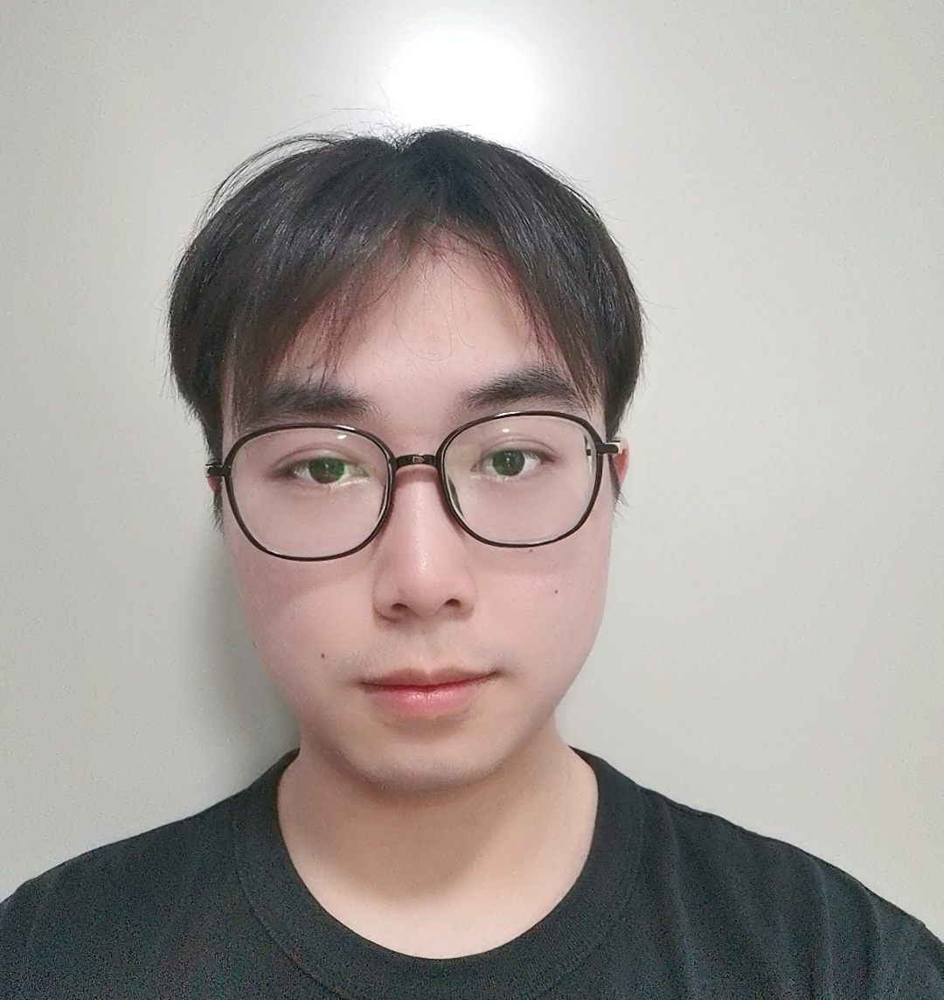

I am a first-year CS Master student in Tsinghua University, advised by [Zhi Wang](http://pages.mmlab.top/). My current research interests are Serverless Computing, AI System and Applied Reinforcement Learning. I got my bachelor degree in [Beijing Normal University](https://www.bnu.edu.cn/).

Email: xiesz1999@163.com

## Publications

## Academic life

## Random thoughts

## My interests

